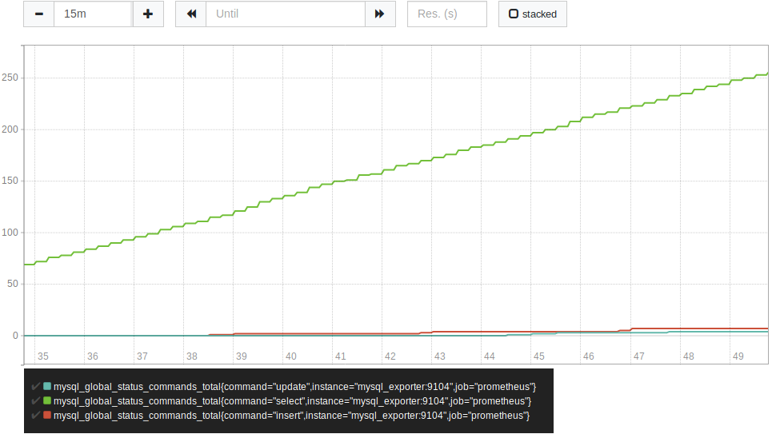
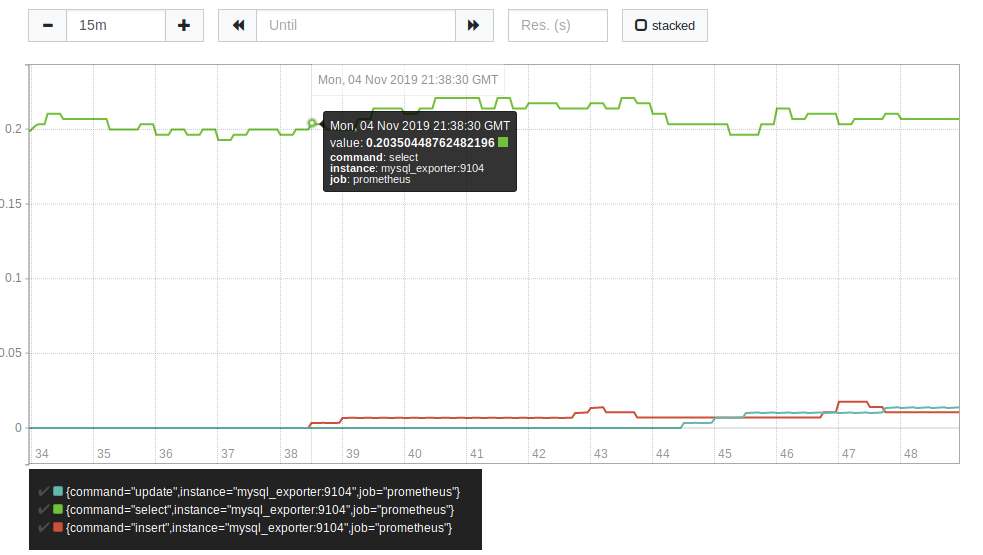

# TP 8 : Monitoring

#### Docker-compose.yml : 
```
version: '3.7'

services:
 mariadb:
  image: mariadb:10.4
  restart: on-failure
  ports:
   - 3306
  environment:
    MYSQL_USER: root
    MYSQL_ROOT_PASSWORD: pass
  volumes:
   - ./maria1:/var/lib/mysql
   - ./backups:/backups

 mysql_exporter:
  image: prom/mysqld-exporter
  restart: on-failure
  environment:
    DATA_SOURCE_NAME: exporter:pass@(mariadb:3306)/
  ports:
   - 9104:9104

 prometheus:
  image: prom/prometheus:latest
  restart: on-failure
  volumes:
   - ./prometheus.yml:/etc/prometheus/prometheus.yml
  ports:
   - 9090:9090

```

#### prometheus.yml : 
```
# my global config
global:
  scrape_interval:     15s # Set the scrape interval to every 15 seconds. Default is every 1 minute.
  evaluation_interval: 15s # Evaluate rules every 15 seconds. The default is every 1 minute.
  # scrape_timeout is set to the global default (10s).

# Alertmanager configuration
#alerting:
#  alertmanagers:
#  - static_configs:
#    - targets:
      # - alertmanager:9093

# Load rules once and periodically evaluate them according to the global 'evaluation_interval'.
rule_files:
  # - "first_rules.yml"
  # - "second_rules.yml"

# A scrape configuration containing exactly one endpoint to scrape:
# Here it's Prometheus itself.
scrape_configs:
  # The job name is added as a label `job=<job_name>` to any timeseries scraped from this config.
  - job_name: 'prometheus'

    # metrics_path defaults to '/metrics'
    # scheme defaults to 'http'.

    static_configs:
            - targets: ['localhost:9090', 'mysql_exporter:9104']
~            
```

#### 1ère requête : 
- Créer un graphique qui affiche les opérations de lectures et d'écritures

```
mysql_global_status_commands_total{command="insert"} or 
mysql_global_status_commands_total{command="update"} or
mysql_global_status_commands_total{command="select"} 
```



#### 2ème requête : 
- Créer un graphique sui affiche la variation du taux d'opérations de lectures et d'écritures en prennat en compte la moyenne sur les 5 dernières minutes

```
rate(mysql_global_status_commands_total{command="insert"}[5m]) or
rate(mysql_global_status_commands_total{command="update"}[5m]) or 
rate(mysql_global_status_commands_total{command="select"}[5m])
```


